# APIDOC PROTECTOR
A simple project to API document protect

# Overview

- Release: 1.0.0

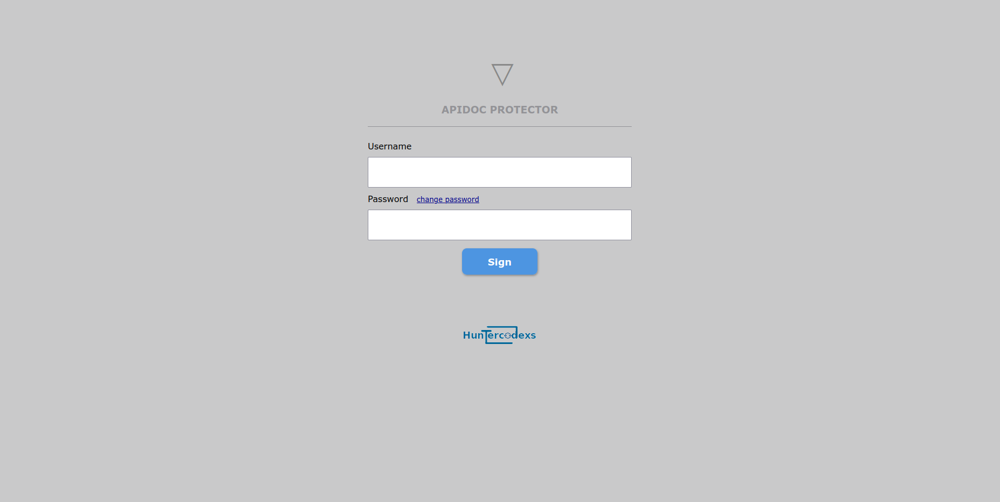

When APIDOC PROTECTOR is installed in the application it catches the requests into endpoints refers to currently manager
documentation, as example in the Swagger, when is requested to http://localhost:31303/swagger-ui/index.html this request
is intercepted and is required a login by username and password.
 
This can be look in ApiDocProtectorSwagger that is placed in the apidocprotector path (package)
in the current application, is very simple just make the correct settings explained below.

> NOTE: All files and scripts is open to review and check the content that each one have, this is will be modified
> in the next releases when will be offers just a jar file as a dependencie, however the source code always stay
> availble to query and warranty secutiry in the use

Below is the diagram flow to summarize as the APIDOC PROTECTOR work.

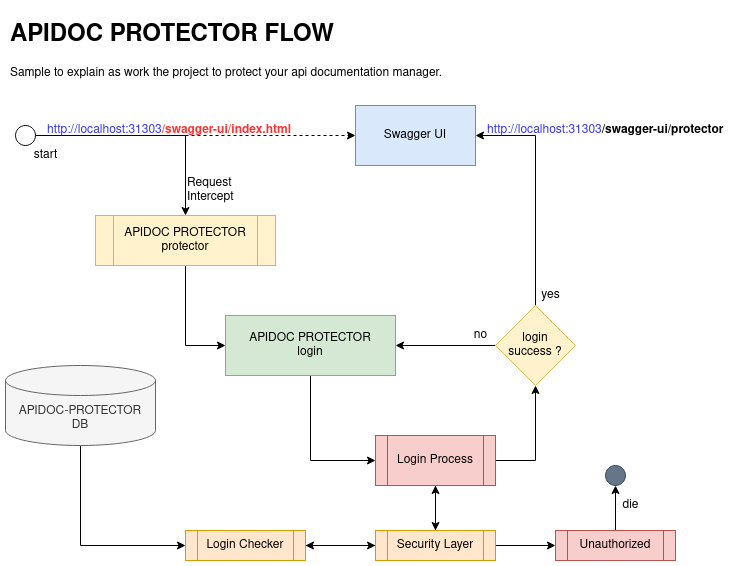

# Resources

* Java 8 (jdk-1.8-212)
* Spring Boot 2.0.1.RELEASE
* Maven Project 2.6.3

# Dependencies

* Lombok
* Spring Data JPA
* Mysql Driver
* Log4j2
* Spring Rest Docs
* Spring Web
* Rest Repositories
* Rest Template
* Swagger (OpenAPI)
* Thymeleaf
* Crypto/MD5

# Environment Details
<pre>

JDK
$ javac -version
javac 1.8.0_212

JRE
$ java -version
java version "1.8.0_212"
Java(TM) SE Runtime Environment (build 1.8.0_212-b10)
Java HotSpot(TM) 64-Bit Server VM (build 25.212-b10, mixed mode)
</pre>

# Maven Commands (jar generate)

1. mvn clean
2. mvn clean install
3. mvn clean compile assembly:single
4. mvn clean package spring-boot:repackage
5. mvn package

# List of Documentation Managers

* OpenAPI with Swagger

> The openAPI with Swagger-UI is available to query and help understand the application by REST API

* http://localhost:31303/swagger-ui/protector

* OpenAPI with Adobe AEM

> The openAPI with Adobe-AEM is available to query and help understand the application by REST API

* http://localhost:31303/adobe-aem/protector

* OpenAPI with Authentiq API

> The openAPI with Authentiq API is available to query and help understand the application by REST API

* http://localhost:31303/authentiq-api/protector

# Workflow Code Details

To clarify and explain with more details about the workflow code, lets started a series of diagrams and the respective 
text about it. In each diagram you can see the initial request until the intecept by APIDOC-PROTECTOR and finally 
arrive in any place previously configured in the application.properties file.

- Generator

In the first diagram we can see the generator flow, where we can see the full process that the request do to get
a html generator page called generator.html.

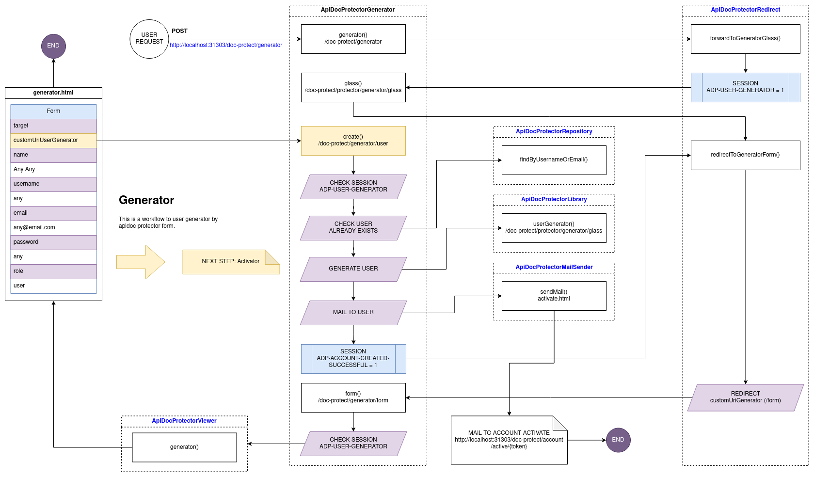

- Activator

The next one diagram are been showed in the below image, and we can see the complete flow to Activator process that refers
to Account Activation after the correct generate Account in the Account Generator of previous step.

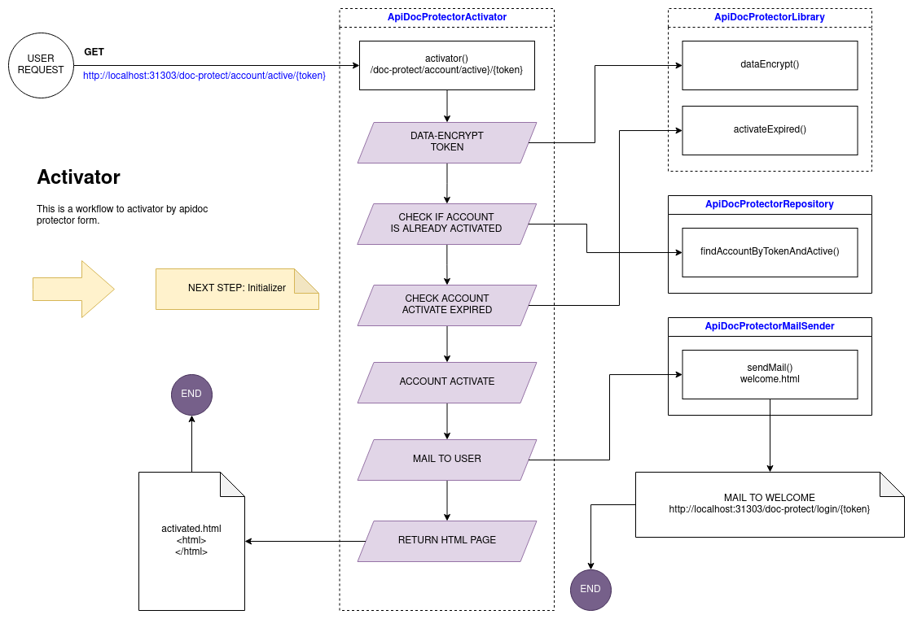

- Initializer

The initializer process is used always the user need to access the documentation that is protected by APIDOC-PROTECTOR. 
This process should be used as explained in this session, e.g., an URL + Token sended by email to right account access. 

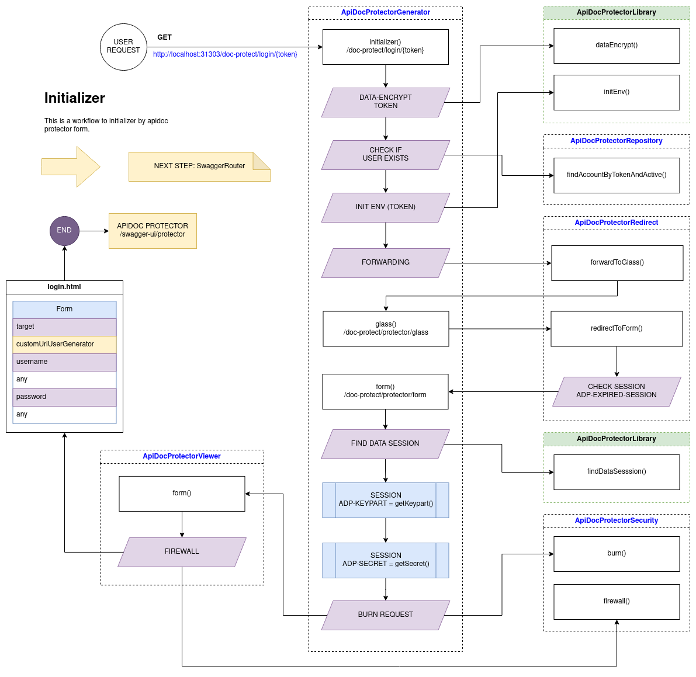

- Swagger Router

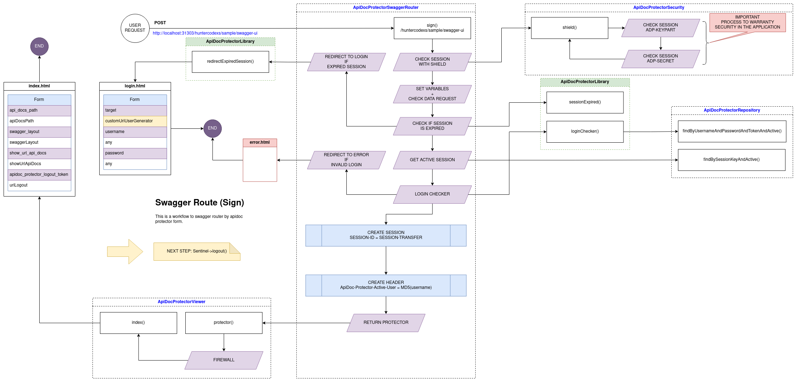

- Refresh

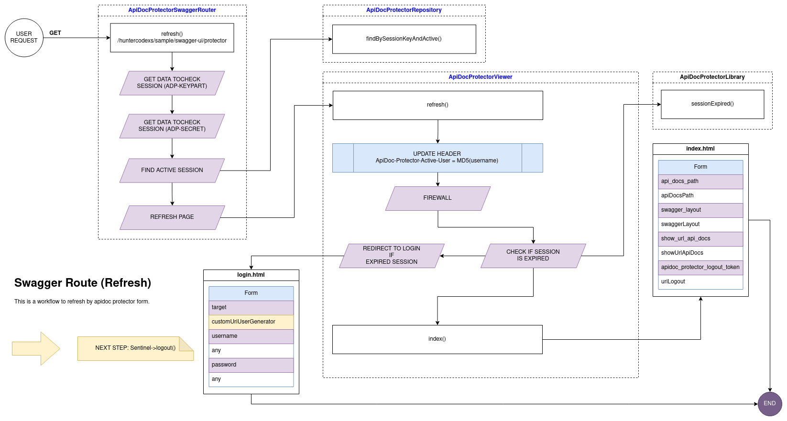

- Password

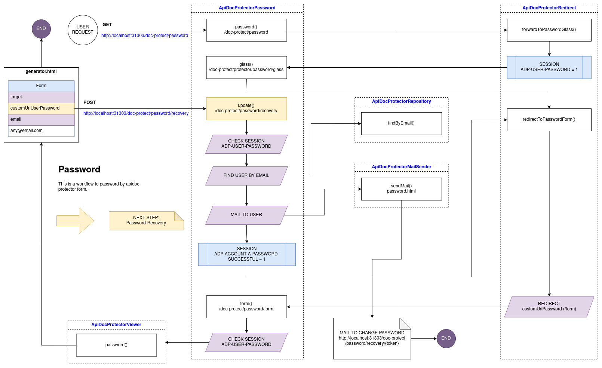

- Password Recovery

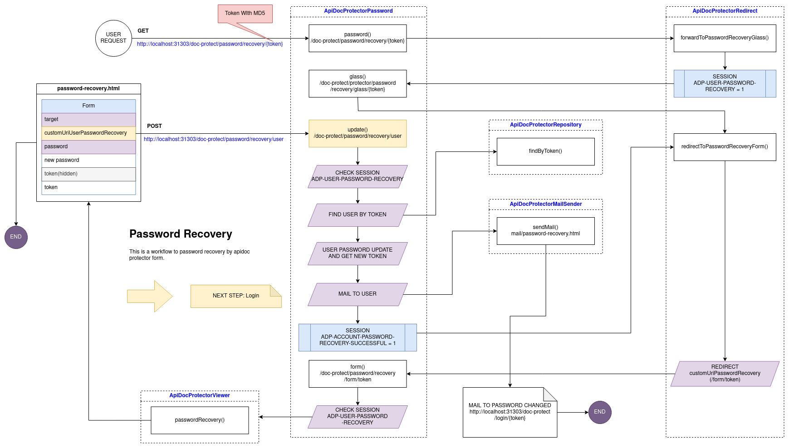

- Recovery

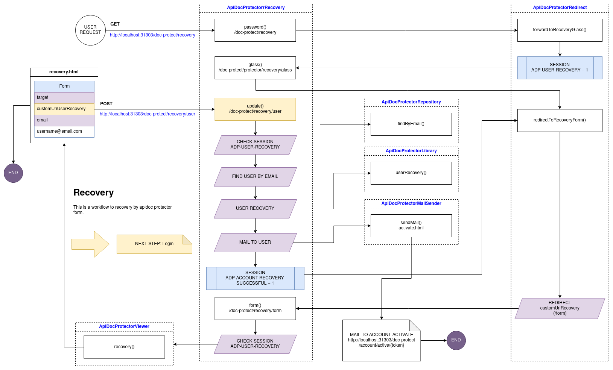

- Sentinel (Root Path)

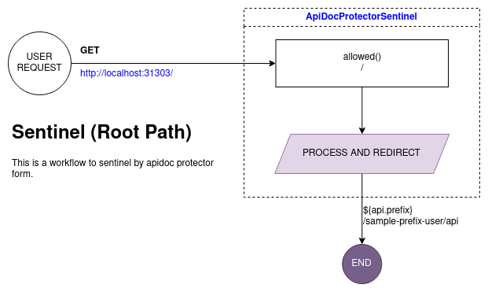

- Sentinel (Docs Path)

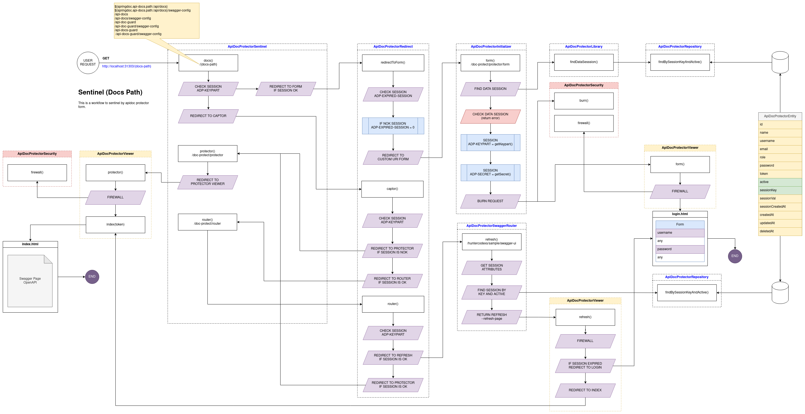

- Sentinel (Protect Path)

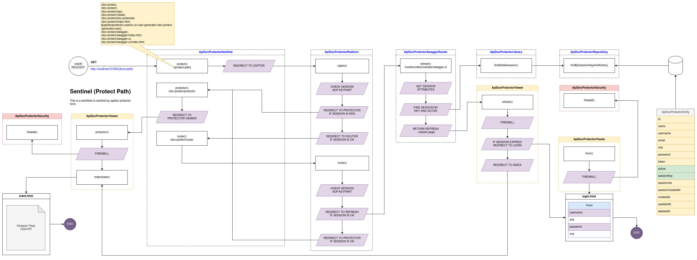

- Sentinel (Router Path)

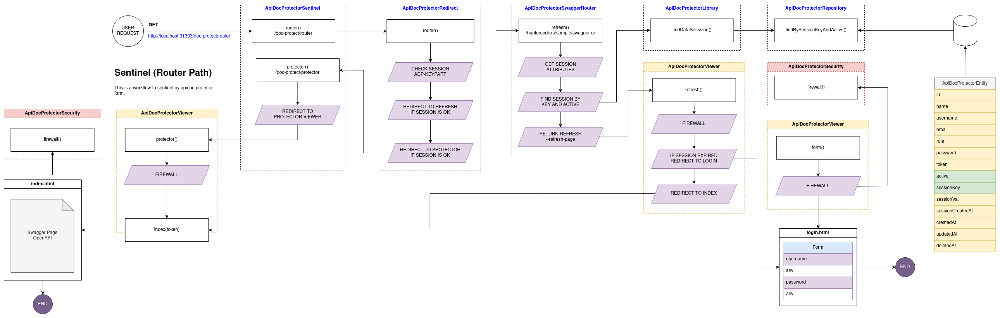

- Sentinel (Logout Path)

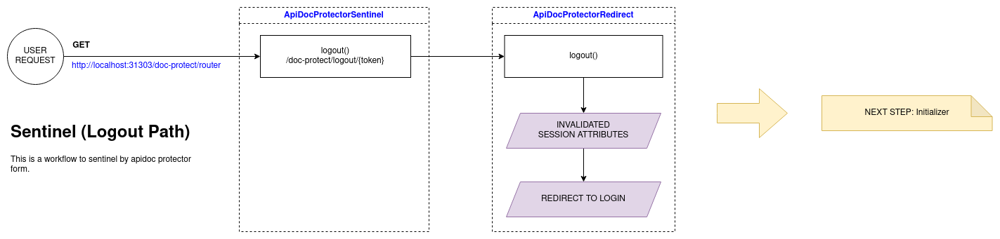

- Sentinel (Protector Path)

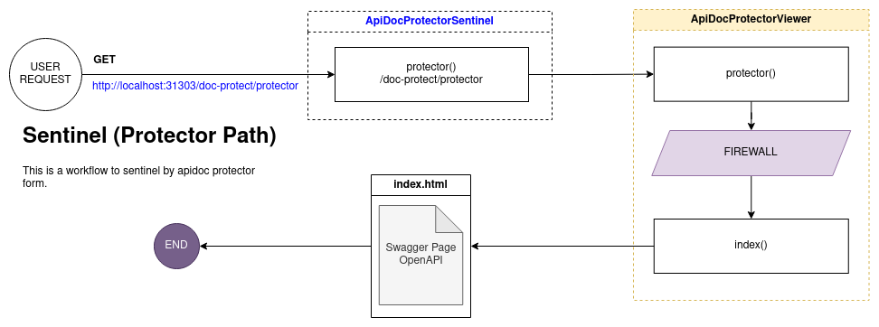

# Usage

Set up the pom.xml with the dependencies below

<code>

		<!--SPRING-BOOT-STARTER-->
		<dependency>
			<groupId>org.springframework.boot</groupId>
			<artifactId>spring-boot-starter-web</artifactId>
		</dependency>

		<!--REST TEMPLATE-->
		<dependency>
			<groupId>org.springframework.boot</groupId>
			<artifactId>spring-boot-starter-data-rest</artifactId>
		</dependency>

		<!--LOMBOK-->
		<dependency>
			<groupId>org.projectlombok</groupId>
			<artifactId>lombok</artifactId>
			<optional>true</optional>
		</dependency>

		<!--DATABASE-->
		<dependency>
			<groupId>org.springframework.boot</groupId>
			<artifactId>spring-boot-starter-data-jpa</artifactId>
		</dependency>
		<dependency>
			<groupId>mysql</groupId>
			<artifactId>mysql-connector-java</artifactId>
			<scope>runtime</scope>
		</dependency>

		<!--DOCUMENT/SWAGGER/OPENAPI-->
		<dependency>
			<groupId>org.springdoc</groupId>
			<artifactId>springdoc-openapi-ui</artifactId>
			<version>1.6.4</version>
		</dependency>

		<!--APIDOC-PROTECTOR (REQUIRED)-->
		<dependency>
			<groupId>org.springframework.boot</groupId>
			<artifactId>spring-boot-starter-thymeleaf</artifactId>
		</dependency>
		<!--APIDOC-PROTECTOR (REQUIRED)-->
        <dependency>
            <groupId>org.springframework.security</groupId>
            <artifactId>spring-security-crypto</artifactId>
            <version>5.6.1</version>
        </dependency>

		<!--MAIL-SENDER-->
		<dependency>
			<groupId>org.springframework.boot</groupId>
			<artifactId>spring-boot-starter-mail</artifactId>
		</dependency>
		<dependency>
			<groupId>org.springframework</groupId>
			<artifactId>spring-context-support</artifactId>
			<version>5.3.15</version>
		</dependency>

</code>

In this release 1.0.0, the unique way to use the APIDOC-PROTECTOR it that showed below, please pay attention when you 
implement this solution in your application to avoid mistakes or forgot anything.

Let's start...

Please, follow the instructions below to install APIDOC PROTECTOR in your application.

- Firstly, access the package com in your application

<pre>
[Example]
user@host$: cd /home/user/sample-project/src/main/java/com
</pre>

- Get the project files from GitHub inside the current path

<pre>
user@host$: git clone https://github.com/huntercodexs/apidoc-protector.git
</pre>

- Get a current release: 1.0.0

<pre>
user@host$: git checkout release_1.0.0
</pre>

- Remove unnecessary files

<pre>
user@host$: cd apidocprotector
user@host$: rm -rf .git .gitignore
user@host$: cd ..
</pre>

Until now, we should have the project structure as below:

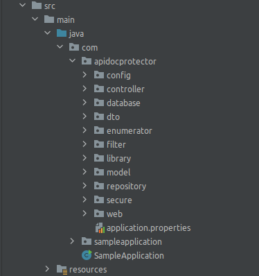

- Copy the template files html from src/main/java/com/apidocprotector/templates to src/main/resources/templates as showed below

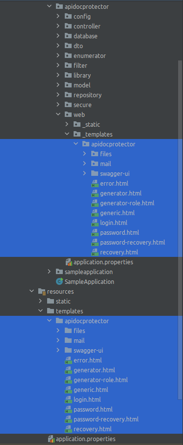

- Now you can configure the application.properties file of your project, as showed below:

<pre>
## SWAGGER
#----------------------------------------------------------------------------------------------------
# See more: https://springdoc.org/properties.html
#true, false
springdoc.swagger-ui.enabled=true
#Any path
springdoc.swagger-ui.path=/huntercodexs/sample/swagger-ui
#Ordered
springdoc.swagger-ui.operationsSorter=method
#StandaloneLayout, BaseLayout
springdoc.swagger-ui.layout=StandaloneLayout
#/api-docs, api-docs/sample, /api-docs-custom
springdoc.api-docs.path=/api-docs/sample
#true, false
springdoc.model-and-view-allowed=true

## APIDOC PROTECTOR
#----------------------------------------------------------------------------------------------------
#true, false
apidocprotector.enabled=false
#localhost, 192.168.0.17, app.domain.com
apidocprotector.server-name=192.168.0.203
#swagger, adobe, authentiq
apidocprotector.type=swagger
#md5, bcrypt
apidocprotector.data.crypt.type=md5
#true, false
apidocprotector.url.show=true
#time to expire session (in minutes): 0,1,3,5,6,7, .... 15,60,148, etc...
apidocprotector.session.expire-time=1
#time to expire email to account activation (in minutes): 20,40,60, etc...
apidocprotector.email.expire-time=1
#custom server domain
apidocprotector.custom.server-domain=http://localhost:31303
#custom uri
apidocprotector.custom.uri-login=/doc-protect/login
apidocprotector.custom.uri-logout=/doc-protect/logout
apidocprotector.custom.uri-form=/doc-protect/protector/form
apidocprotector.custom.uri-user-generator=/doc-protect/generator/user
apidocprotector.custom.uri-user-recovery=/doc-protect/recovery/user
apidocprotector.custom.uri-user-password=/doc-protect/password/user
apidocprotector.custom.uri-user-password-recovery=/doc-protect/password/recovery/user
apidocprotector.custom.uri-generator=/doc-protect/generator
apidocprotector.custom.uri-account-active=/doc-protect/account/active
apidocprotector.custom.uri-recovery=/doc-protect/recovery
apidocprotector.custom.uri-password=/doc-protect/password
apidocprotector.custom.uri-password-recovery=/doc-protect/password/recovery

## APIDOC PROTECTOR (JAVA MAIL SENDER)
#----------------------------------------------------------------------------------------------------
### Tip: Use an test mail server as the MailHog (see more in docker-series ion GitHub huntercodexs account)
spring.mail.host=192.168.0.174
spring.mail.port=31025
spring.mail.username=huntercodexs@mail.com
spring.mail.password=
spring.mail.properties.mail.smtp.auth=false
spring.mail.properties.mail.smtp.starttls.enable=true
spring.mail.properties.mail.smtp.connectiontimeout=5000
spring.mail.properties.mail.smtp.timeout=5000
spring.mail.properties.mail.smtp.writetimeout=5000
spring.mail.properties.mail.smtp.socketFactory.port=31025
spring.mail.properties.mail.smtp.socketFactory.class=javax.net.ssl.SSLSocketFactory
</pre>

# Properties File

> NOTE: you can personlize the all options/features to get more confidente and security in the application implementation,
> main in the custome.uri path

There is a many settings tha can be made in the application.properties file, but we can talk about the options on  

<pre>
## APIDOC PROTECTOR
## APIDOC PROTECTOR (JAVA MAIL SENDER)
</pre>

- APIDOC PROTECTOR OPTIONS 
  - apidocprotector.enabled: 
    - Use true or false to enabled/disable the APIDOC PROTECTOR
  - apidocprotector.server-name: 
    - Define where the application is running and will be used by Firewall in the APIDOC PROTECTOR
  - apidocprotector.type: 
    - Define wich kind of OPENAPI will be used, swagger, abode-aem or authentiq
  - apidocprotector.data.crypt.type: 
    - Set the kind of algorithm to data cipher
  - apidocprotector.url.show: 
    - Use true or false to mean if the doc-path url should be view
  - apidocprotector.session.expire-time: 
    - Define the time to session expire (in minutes), if value is 0 then expired time will be disabled
  - apidocprotector.email.expire-time: 
    - Define the time to email expire (in minutes), if value is 0 then expired time will be disabled
  - apidocprotector.custom.server-domain: 
    - Define where the APIDOC PROTECTOR is running 
  - apidocprotector.custom.uri-login: 
    - URI to redirect login form, default is /doc-protect/login 
  - apidocprotector.custom.uri-logout: 
    - URI to redirect user after logout, default is /doc-protect/logout 
  - apidocprotector.custom.uri-form: 
    - URI to redirect user to make a login, default is /doc-protect/protector/form 
  - apidocprotector.custom.uri-user-generator: 
    - URI defined to generator new account, default is /doc-protect/generator/user 
  - apidocprotector.custom.uri-user-recovery: 
    - URI that refer to recovery functionaly, default is /doc-protect/recovery/user 
  - apidocprotector.custom.uri-user-password: 
    - URI to user define a new password, default is /doc-protect/password/user 
  - apidocprotector.custom.uri-user-password-recovery: 
    - URI to user recovery the forgot password, default is /doc-protect/password/recovery/user 
  - apidocprotector.custom.uri-generator: 
    - URI to generate a form generator and generate an new user, default is /doc-protect/generator 
  - apidocprotector.custom.uri-account-active: 
    - URI to active account when it is required by email, default is /doc-protect/account/active 
  - apidocprotector.custom.uri-recovery: 
    - URI to account recovery, default is /doc-protect/recovery 
  - apidocprotector.custom.uri-password: 
    - URI to password, default is /doc-protect/password 
  - apidocprotector.custom.uri-password-recovery: 
    - URI to password recovery, default is /doc-protect/password/recovery

- APIDOC PROTECTOR (JAVA MAIL SENDER)
  - spring.mail.host:
    - Set the hostname or IP Address to host mail server, example: 192.168.0.174 
  - spring.mail.port:
    - Set the port to host mail server, example: 31025 
  - spring.mail.username:
    - Set the origin mail to send mail, example: huntercodexs@mail.com 
  - spring.mail.password:
    - Set the password to mail sender if required, example: @gmail.com
  - spring.mail.properties.mail.smtp.auth:
    - Set if mail server required Authentication, use true or false 
  - spring.mail.properties.mail.smtp.starttls.enable:
    - Set if mail server require TLS secure layer, use true or false 
  - spring.mail.properties.mail.smtp.connectiontimeout:
    - Set time to connection timeout, example: 5000 
  - spring.mail.properties.mail.smtp.timeout:
    - Set time to send mail timeout, example: 5000 
  - spring.mail.properties.mail.smtp.writetimeout:
    - Set time to write mail timeout, example 5000 
  - spring.mail.properties.mail.smtp.socketFactory.port:
    - Set the port to communication between client and server mail, example: 31025 
  - spring.mail.properties.mail.smtp.socketFactory.class:
    - Set the kind of SSL socket, use javax.net.ssl.SSLSocketFactory if you don't know

> Tip: Use a mail server test as the MailHog (see more in docker-series ion GitHub huntercodexs account)

# Database Details

APIDOC PROTECTOR use the MySQL by JPA to manager access and data audit in the project, so will be checkout and warranty that 
this dependecies are been installed in the project and environment. Once of installed the project can be running without 
problems. One table called apidoc_protector will be created in the database, where the user data will be record and 
storaged in that table, and other table called apidoc_protector_audit will be created to make an audit of all process that 
occurs in the application.

The table apidoc_protector have the follow fields:

<pre>
id;name;username;email;role;password;token;active;sessionKey;sessionVal;sessionCreatedAt;createdAt;updatedAt;deletedAt;
</pre>

Let me explain the more importants fields in this context.

***name:*** Refers the ame of user

***email:*** Refers to email that use has been used in the generator account

***role:*** Is a kind of user (admin, user, viewer, editor, etc...)

***token:*** This is a more sensitive data, without it the user can't access the login form

***sessionKey:*** This is an internal process of the APIDOC PROTECTOR, and will be used to find out the sessionVal

***sessionVal:*** Is this literaly the user session id that can be accesed by correct login of the valid account

***sessionCreatedAt:*** This is a date data, used to contol the user session (timeout or session expired)

> APIDOC PROTECTOR AUDITOR

The table apidoc_protector_audit have the follow fields:

<pre>
id;username;level;token;tracker;detail;message;ip;createdAt;
</pre>

About these fields above we can say wich the most importants:

***tracker:*** Tracker code to track the request information

***detail:*** Details about the tracker code

***message:*** Message refer the tracker code

> To more details, see the source code from APIDOC PROTECTOR

# Account Creation

- Get the URL to User Generator
  - http://localhost:31303/doc-protect/generator
- Access email to activate account
  - Click on the link (Activate Account)
- After clicking on the link to activate the account
  - Check welcome email to APIDOC PROTECTOR
  - Click on the link (click here) to access the account
- Access the account (via link sent by email)
  - http://localhost:31303/doc-protect/protector/form#x-padlock

# Account Recovery

- Access form to generate new user
  - http://localhost:31303/doc-protect/generator
- Click on Account Recovery
  - http://localhost:31303/doc-protect/recovery/form#x-padlock
  - Enter a valid email (which was used for registration)
  - Check email
  - Click on the Activate Account link
  - A new email will be sent to access the account with a new token
  - Inform username and password

# Login

> NOTE: It is not possible to login without going through the login form

- To access the login form, you need to know the access link with the valid token, this link may be
  saved in your email, or be recovered in the Account Recovery process, example:
- http://localhost:31303/doc-protect/login/287891be-aa00-4422-88cd-b52ae7645d0b

# Password Recovery

- On the login screen click on "change password"
  - http://localhost:31303/doc-protect/password
  - A screen will open asking for the email address
    - Enter the email to start the password recovery process
    - Check your email to set a new password
    - Enter your new password on the password recovery screen
    - A new link will be generated for access, example:
      - http://localhost:31303/doc-protect/login/6a27a71d-2d4c-40e0-bcd6-d782db72b9a8
    - Click on the link and login with the new password

#  Account Expired

> There is time to access the account for the first time after a user generated by the account generator form,
> therefore it is necessary to check carefully what the email says about the time for account activation

# Invalid Account

If an account is invalid or not found, an error or exception will be thrown on the screen.

# Session Expired

When the session expires, the user is directed to the login screen.

# Intercepted flow

All endpoints that will be intercepted can be seen in the application.properties configuration file, and the others
endpoints to be intercepted can be seen in the file ApiDocProtectorSentinel.java and ApiDocProtectorSwaggerRouter.java

# Advanced

- OAuth2 Settings

If your application use the OAuth2 as a security layer, can be needed to make any configurations in the scope of the
project as showed below...

<code>

    @Override
    public void configure(final HttpSecurity http) throws Exception {
       http.authorizeRequests()

               /*APP SERVICES*/
               .antMatchers("/users/delete").authenticated()
               .antMatchers("/users/create").authenticated()

               /*OTHERS SERVICES*/
               .antMatchers("/auditory/view").authenticated()

               /*SWAGGER*/
               .antMatchers("/swagger/**").permitAll()
               .antMatchers("/swagger-ui/**").permitAll()
               .antMatchers("/api-docs/**").permitAll()
               .antMatchers("/api-docs.yaml").permitAll()

               /*API-DOC-GUARD*/
               .antMatchers("/doc-protect/**").permitAll()
               .antMatchers("/api-doc-guard/**").permitAll()
               .antMatchers("/api-docs-guard/**").permitAll()

               /*CUSTOM*/
               .antMatchers(custom_api_prefix+"/swagger/**").permitAll()
               .antMatchers(custom_api_prefix+"/swagger-ui/**").permitAll()
               .antMatchers(custom_api_prefix+"/doc-protect/**").permitAll()
               .antMatchers(custom_api_prefix+"/api-doc-guard/**").permitAll()
               .antMatchers(custom_api_prefix+"/api-docs-guard/**").permitAll()

               /*ACTUATOR*/
               .antMatchers("/actuator/**").permitAll().anyRequest().authenticated();
    
    }

</code>
